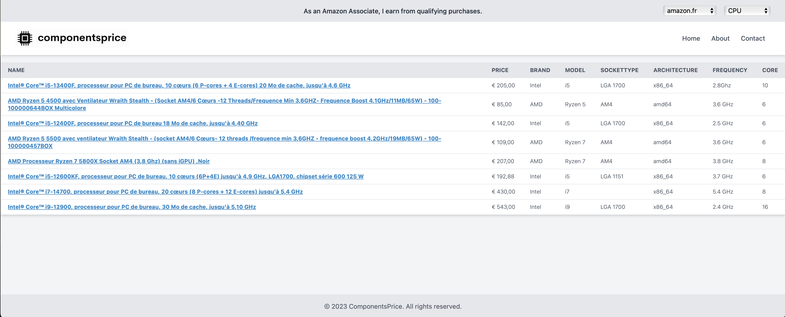

# componentsprice

**ComponentsPrice** project has been canceled.

**ComponentsPrice** was supposed to be a price comparison tool for computer components (CPU, GPU, RAM, etc.) available on Amazon. However, Amazon has denied us access to their API, which is essential for retrieving product information.

Without access to this data, we cannot continue with the project.

